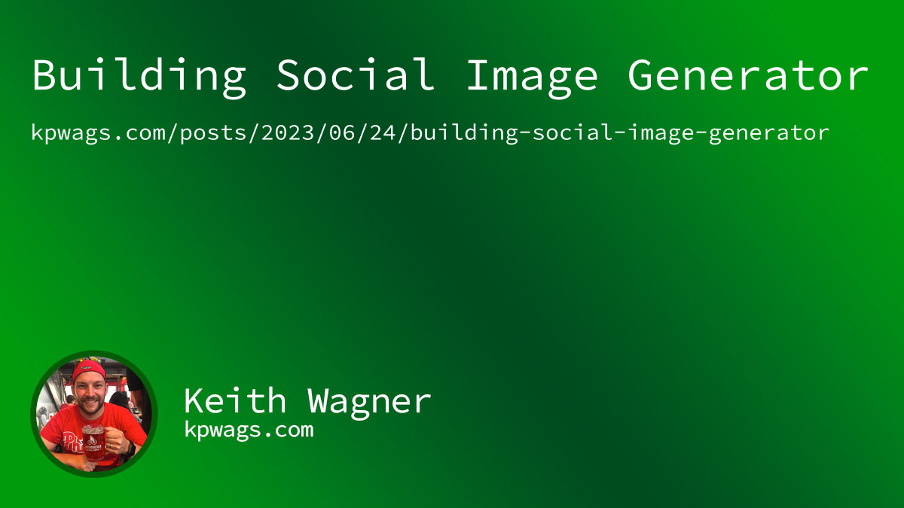

# Social Image Generator

I built this little console app to generate social images for my blog posts. Faster and easier than opening Photoshop. It uses the [Six Labors ImageSharp](https://docs.sixlabors.com/index.html) library to write text on my template image.

It takes some input from the console and outputs the image to the appropriate directory. I might end up trying to automate more of it as time goes on, but for now it takes the date, slug & title and it does the rest automatically.

## Template

## Example Output

